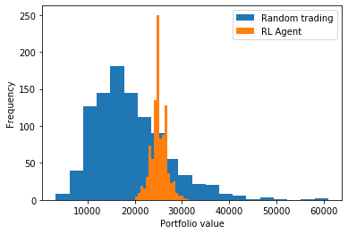

# Reinforcement Learning Trading Project
In this repositary I will explore usage of Reinforcement Learning (Q-Learning) to Stock Market. I use couple of simplifications:
  * Ignore trading fees
  * If agent wants to sell -> sell all shares of given stock
  * If agent wants to buy -> buy as many as possible (in case of multiple buy signals it buys in rounds)
  * Sell before buy
  
So any action follows specified order.

State is represented by past stock returns, I used 7 days window, number of shares we own, and how much cash we have at hand. Model used is simple regression neural network. I want to explore usage of RNNs in future.
You can explore difference in portfolio returns between model with and without past stock prices in  branch called "simple-state". The state only contains shares owned, current prices and cash at hand. 

## Results
I run a test with dataset "corn_sugar_gold.csv". The final reward on trainig set was 109570 (agent started with 20k). The histogram shows difference in random trading and trading made by agent on testing dataset (30% of the data). The difference is statistically significant (z-score around 20). On the other hand, profits are not that high considering that starting portfolio value was 20k. It's possible that fees would eat all our profit and thus make this strategy fruitless.

## Description
 * run.py - manages training and testing
 * evaluate.py - draws histograms (random vs agent) and computes statistical test
 * agent.py - contains Agent class
 * enviroment.py - contains Enviroment class
 * src.py - contains Replay Buffer class and some general functions
 * data folder - contains two datasets:
   * stock_prices.csv - stocks for apple, starbucks and motorola; small developing dataset
   * sugar_corn_gold.csv - data from 1.1.2000 to 29.5.2020, dataset on which I performed reported test
